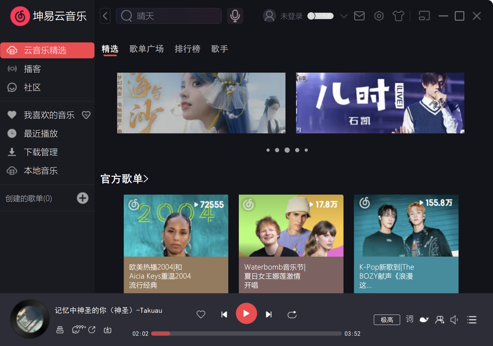
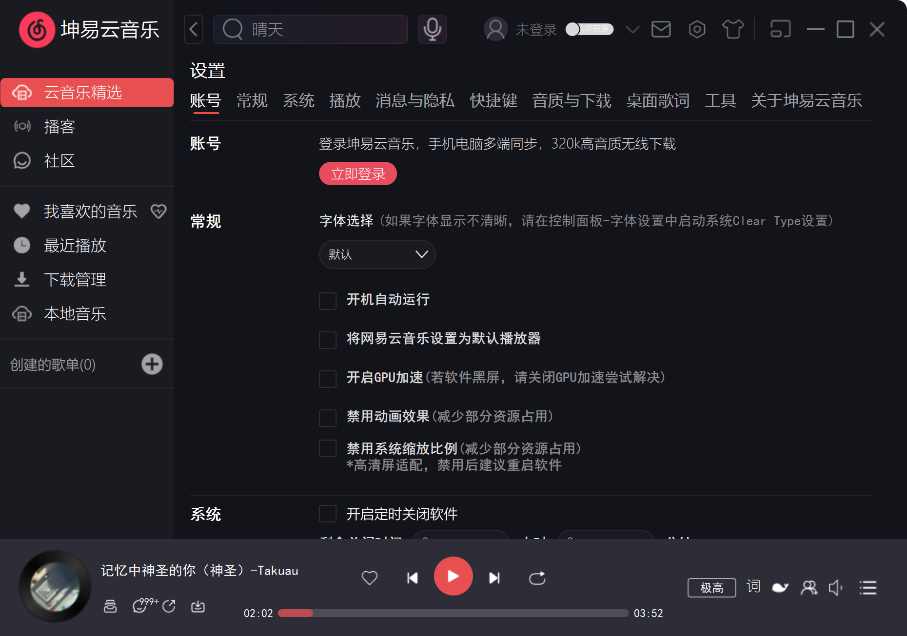
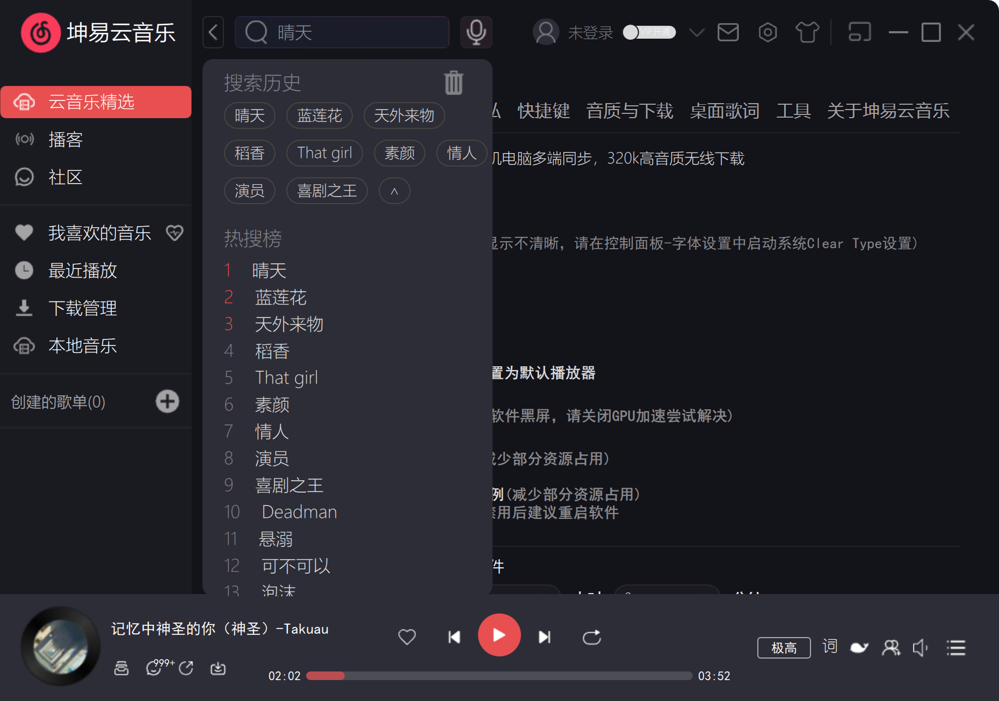
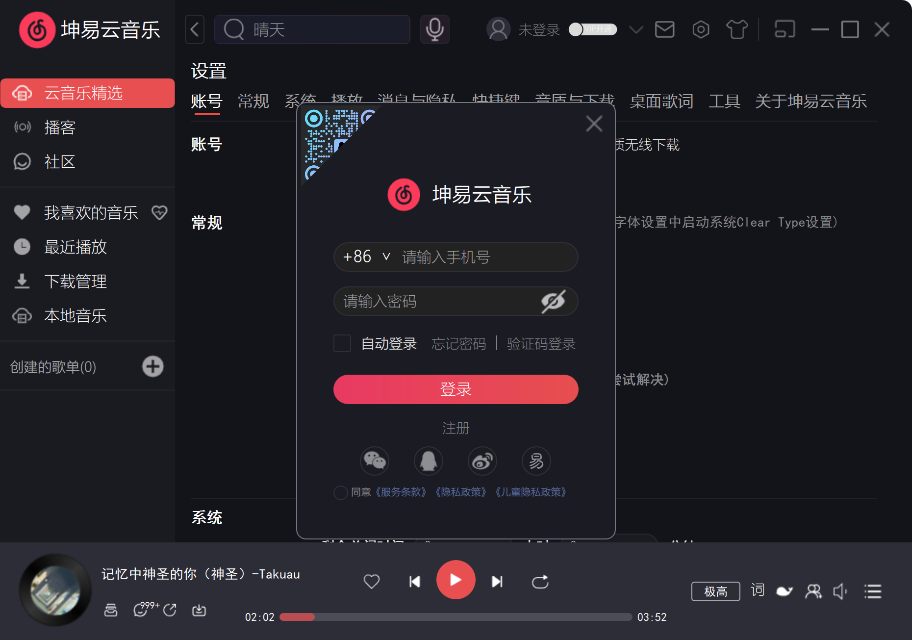
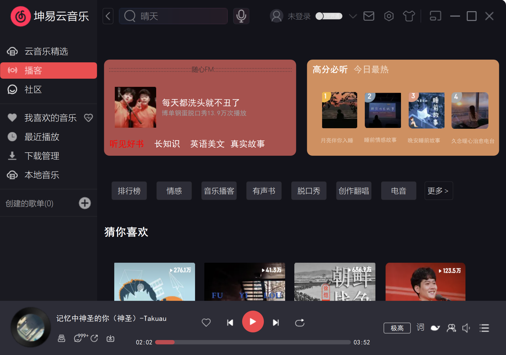

# 坤易云音乐 (KYYMusic)

基于 QML 的网易云音乐界面仿制项目

## 项目背景

坤易云音乐是一个基于 Qt/QML 技术栈开发的桌面音乐播放器应用，致力于完美复刻网易云音乐的经典界面设计和用户体验。项目旨在通过现代化的 QML 技术重现网易云音乐的视觉效果和交互逻辑，为用户提供熟悉而优雅的音乐播放体验。

该项目不仅是对经典音乐应用界面的致敬，更是对 Qt/QML 跨平台开发能力的深度探索和实践。通过精心设计的组件化架构和丰富的视觉效果，展现了现代桌面应用开发的技术魅力。

## 技术栈

### 核心技术
- **Qt 5.15.2** - 跨平台应用开发框架
- **QML** - 声明式用户界面标记语言
- **JavaScript** - 业务逻辑处理和事件响应
- **C++** - 底层逻辑和性能关键模块

### 开发环境
- **Qt Creator** - 集成开发环境
- **MSVC 2019** - Windows 平台编译器
- **qmake** - 项目构建系统

### 图形技术
- **Qt Quick** - 现代化 UI 框架
- **Qt Graphical Effects** - 图形特效支持
- **SVG/PNG** - 矢量和位图资源

## 实现功能

### 🎵 播放界面（仅展示效果）
- **音乐播放控制** - 播放、暂停、上一首、下一首
- **播放模式切换** - 单曲循环、列表循环、随机播放
- **音量控制** - 可视化音量调节滑块
- **播放进度** - 实时进度显示和拖拽控制

### 🎨 界面模块
- **左侧导航栏** - 云音乐精选、播客、社区、我的音乐等
- **主内容区域** - 动态页面切换和内容展示
- **播放控制栏** - 底部固定播放控制面板
- **顶部标题栏** - 搜索、用户信息、设置等功能

### 📱 页面功能
- **云音乐精选** - 轮播图、官方歌单、最新音乐推荐
- **歌单广场** - 精选歌单展示和分类浏览
- **排行榜** - 各类音乐排行榜展示
- **歌手页面** - 歌手信息和作品展示
- **设置中心** - 账号、播放、系统等全面设置

### 🔧 高级特性
- **登录系统** - 扫码登录和多种登录方式
- **响应式布局** - 自适应不同窗口尺寸
- **动画效果** - 流畅的页面切换和交互动画
- **组件化设计** - 可复用的自定义UI组件

## 达到目的

### 🎯 技术目标
- **QML 技术实践** - 深度掌握 QML 声明式编程范式
- **组件化开发** - 构建可维护、可扩展的组件体系
- **跨平台兼容** - 实现 Windows/Linux/macOS 多平台支持
- **性能优化** - 流畅的动画效果和高效的资源管理

### 🎨 设计目标
- **界面还原度** - 高度还原网易云音乐的视觉设计
- **用户体验** - 提供直观、流畅的交互体验
- **视觉一致性** - 保持整体设计风格的统一性
- **细节打磨** - 精心处理每个交互细节和视觉效果

### 📚 学习目标
- **现代UI开发** - 掌握现代桌面应用UI开发技术
- **架构设计** - 学习大型前端项目的架构设计模式
- **工程实践** - 积累实际项目开发和维护经验

## 应用方向

### 🎵 音乐娱乐
- **个人音乐播放器** - 作为日常音乐播放工具使用
- **音乐管理系统** - 本地音乐文件的组织和管理
- **音乐发现平台** - 探索和发现新音乐内容

### 💻 技术应用
- **Qt/QML 学习** - 作为 QML 技术学习的实践项目
- **界面设计参考** - 为其他音乐应用提供界面设计灵感
- **组件库开发** - 提取通用组件用于其他项目开发

### 🏢 商业价值
- **产品原型** - 作为音乐类产品的快速原型开发
- **技术展示** - 展示团队的前端开发技术实力
- **用户研究** - 进行音乐应用用户体验研究

## 项目亮点

### ✨ 技术亮点
- **🏗️ 模块化架构** - 采用清晰的目录结构和组件分离设计
- **🎨 自定义组件库** - 丰富的可复用 UI 组件 (KYYButton、KYYSlider 等)
- **📱 响应式设计** - 支持全屏和窗口模式的自适应布局
- **🔄 状态管理** - 基于 BasicConfig 的全局状态管理机制
- **🎭 动画系统** - 流畅的页面切换和交互动画效果

### 🎨 设计亮点
- **🎯 高还原度** - 精确复刻网易云音乐的视觉设计语言
- **📐 像素级精度** - 精确的布局和间距控制
- **🖼️ 丰富资源** - 完整的图标和图片资源体系
- **💫 视觉特效** - 图形特效和阴影效果的巧妙运用

### 🚀 功能亮点
- **🔍 智能搜索** - 集成搜索功能和历史记录
- **📊 数据展示** - 轮播图、排行榜等多样化内容展示
- **⚙️ 完整设置** - 涵盖账号、播放、系统等全方位设置选项
- **🎪 交互体验** - 丰富的鼠标悬停效果和点击反馈
- **📱 多页面支持** - 完整的页面导航和状态保持机制

### 🔧 工程亮点
- **📁 清晰架构** - 按功能模块组织的清晰目录结构
- **🔗 资源管理** - 统一的资源文件组织和引用机制
- **🧩 组件复用** - 高度可复用的自定义组件设计
- **📝 代码规范** - 良好的代码风格和注释规范
- **🔄 版本控制** - 完整的项目文件和构建配置

### 项目结构
```
KYYMusic/
├── Src/                    # 源代码目录
│   ├── basic/             # 基础配置和工具
│   ├── commonUI/          # 通用UI组件
│   ├── leftPage/          # 左侧导航页面
│   ├── rightPage/         # 主内容区域
│   ├── playMusic/         # 播放控制模块
│   └── js/                # JavaScript 脚本
├── Resources/             # 资源文件目录
└── main.qml              # 应用入口文件
```









